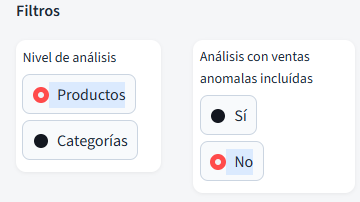
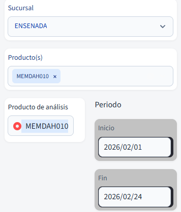
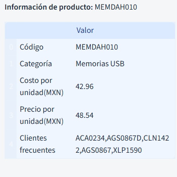
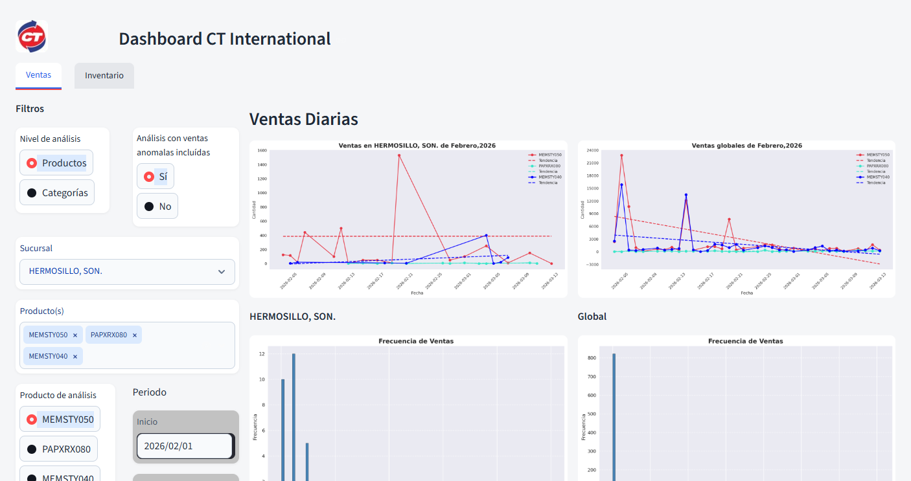
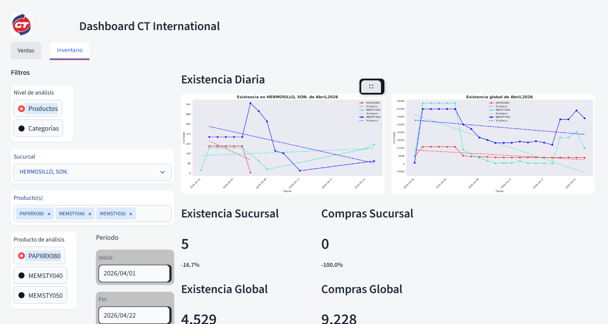
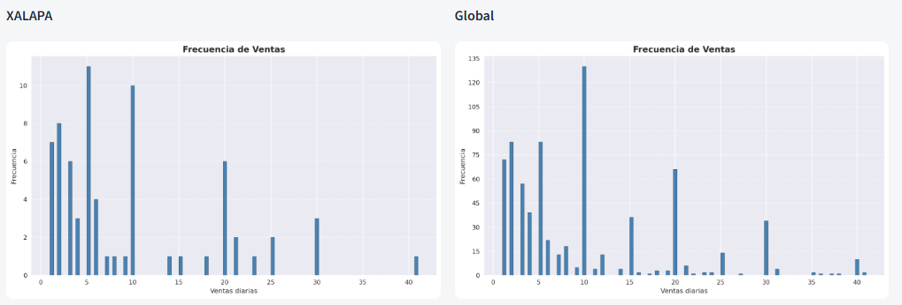
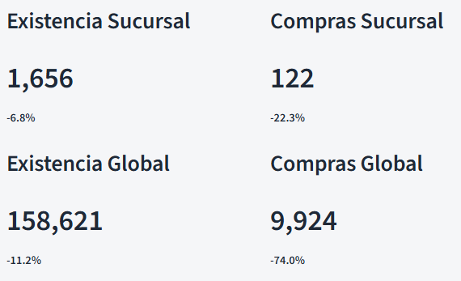
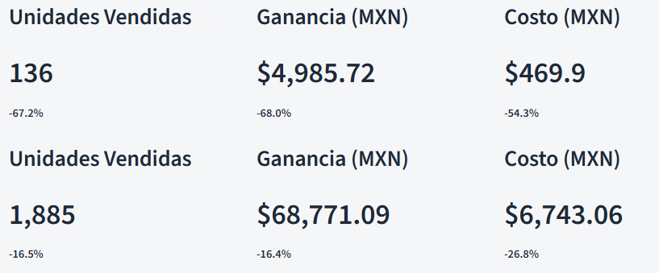
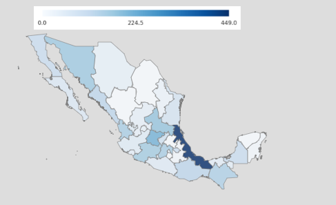
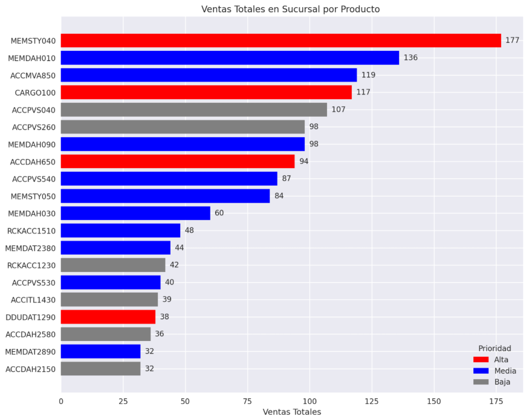

# Dashboard de Ventas e Inventario

Aplicación web construida con Streamlit para el monitoreo continuo de ventas e inventario de productos. Su objetivo es centralizar las visualizaciones clave que apoyan la toma de decisiones en el surtimiento de productos.

## Instalación

**Requisitos previos:** `podman >= 5.4` y `podman-compose >= 0.11`

1. Copia el archivo `compose.yml` en la raíz del proyecto.
2. Levanta la aplicación:

```bash
podman compose up -d
```

### Actualización

```bash
podman compose down
podman compose up -d
```

---

```
podman compose up -d 
```

Para actualizar, uno simplemente ejecuta:
```
podman compose down 
podman compose up -d 
```

---

## Guía de Uso

Una vez iniciada la aplicación, accede a `http://<host>:8501`. Se mostrará por defecto la pestaña de **Ventas de Productos**.

### Filtros

#### Filtros de elemento

Permite analizar los datos tanto por productos individuales como por categorías. También es posible excluir las ventas atípicas del análisis.

<p align="left">
  
</p>

#### Filtros de análisis

Aquí se seleccionan los productos a comparar (hasta cuatro en la gráfica de ventas), el producto o categoría principal, la sucursal y el período de análisis.

<p align="left">
  
</p>

#### Información del elemento

En el panel izquierdo se despliega la ficha del elemento seleccionado (producto o categoría), que incluye: código, categoría, costo unitario, precio promedio por unidad y clientes frecuentes.

<p align="left">
  
</p>

---

### Gráficas

#### Ventas e Inventario diario

Muestra las unidades vendidas por día (pestaña de Ventas) o la existencia diaria (pestaña de Inventario), tanto a nivel de sucursal como a nivel global, para comparar el comportamiento particular con la tendencia general.

<p align="left">
  
  
</p>

#### Frecuencia de pedidos

Indica con qué frecuencia se realizan pedidos de determinada cantidad de unidades del producto dentro del período seleccionado.

<p align="left">
  
</p>

#### KPIs

Concentra los indicadores clave para la toma de decisiones: unidades vendidas, costo total y ganancia total del elemento seleccionado.

<p align="left">
  
  
</p>

#### Mapa de calor

Visualiza la actividad de ventas o inventario por zona geográfica, facilitando identificar qué sucursales requieren mayor stock ante posibles picos de demanda.

<p align="left">
  
</p>

#### Gráfica de prioridades

Muestra los productos con mayor prioridad de surtimiento junto con su volumen de ventas en el período. La prioridad se determina con base en el valor aportado al total mensual, usando el costo del producto como criterio (al ser un valor generalmente estable).

<p align="left">
  
</p>

---

## Demo

<p align="left">
  
</p>

---

## Tech Stack

| Capa | Tecnología |
|------|------------|
| Frontend / Visualización | Streamlit |
| Contenerización | Podman + podman-compose |
| Lenguaje | Python |
| Bases de datos | PostgreSQL 15.0, PostGIS 15.4 |