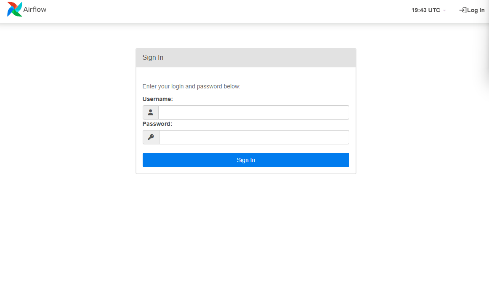
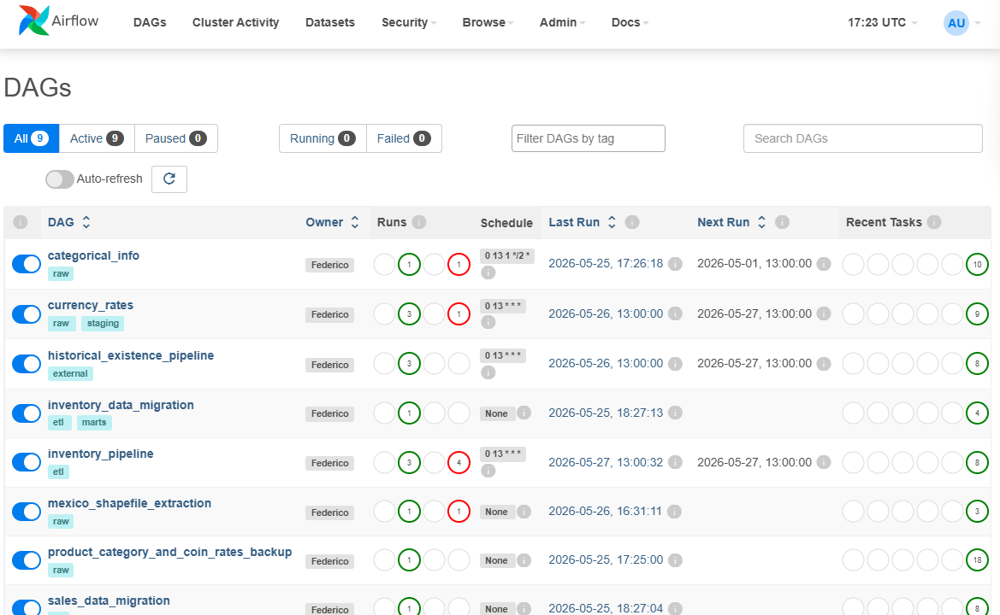
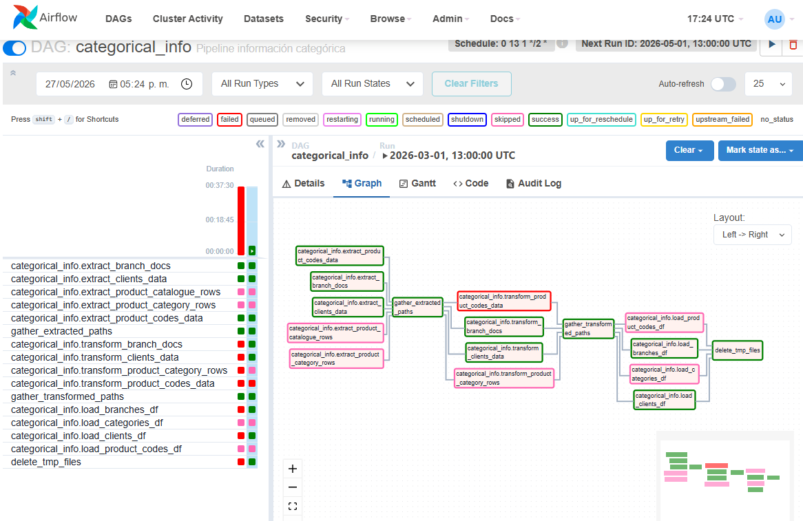
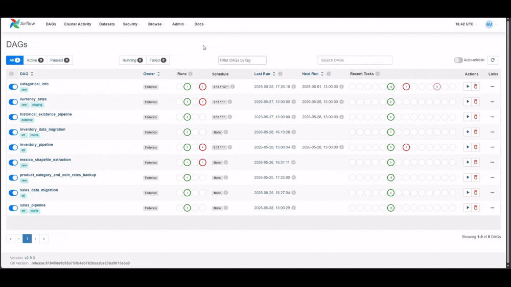

# Gestor de Pipelines de Datos con Apache Airflow
[![Python][python-shield]][python-url]
[![Markdown][md-shield]][md-url]
[![Git][git-shield]][git-url]
[![Github][github-shield]][github-url]
[![PostgreSQL][postgres-shield]][postgres-url]
[![Airflow][airflow-shield]][airflow-url]
[![Pandas][pandas-shield]][pandas-url]
[![Podman][podman-shield]][podman-url]


[postgres-shield]: https://img.shields.io/badge/PostgreSQL-4169E1?style=for-the-badge&logo=postgresql&logoColor=white
[postgres-url]: https://www.postgresql.org/

[airflow-shield]: https://img.shields.io/badge/Apache%20Airflow-017CEE?style=for-the-badge&logo=apacheairflow&logoColor=white
[airflow-url]: https://airflow.apache.org/

[pandas-shield]: https://img.shields.io/badge/Pandas-150458?style=for-the-badge&logo=pandas&logoColor=white
[pandas-url]: https://pandas.pydata.org/

[podman-shield]: https://img.shields.io/badge/Podman-892CA0?style=for-the-badge&logo=podman&logoColor=white
[podman-url]: https://podman.io/

[python-shield]: https://img.shields.io/badge/python-3670A0?style=for-the-badge&logo=python&logoColor=ffdd54
[python-url]: https://www.python.org/

[md-shield]: https://img.shields.io/badge/Markdown-000?style=for-the-badge&logo=markdown
[md-url]: https://www.markdownguide.org/

[git-shield]: https://img.shields.io/badge/GIT-E44C30?style=for-the-badge&logo=git&logoColor=white
[git-url]: https://git-scm.com/

[github-shield]: https://img.shields.io/badge/GitHub-100000?style=for-the-badge&logo=github&logoColor=white
[github-url]: https://github.com/


Gestor de pipelines de datos que utiliza Apache Airflow para visualizar y monitorear pipelines esenciales del proyecto. La idea es poder identificar los componentes fundamentales de cada proceso para agilizar el mantenimiento del proyecto. Se pueden vigilar los tiempos de ejecución , procesos agendados , logs y los estados de tareas para cada DAG configurado. 


## Variables de Entorno

### Facturas, existencia y sucursales
```env
API_MONGO_URI                  # URI de la fuente de datos de la API pública
API_MONGO_DB_NAME
INVOICES_COLLECTION            # Colección de facturas
BRANCHES_COLLECTION            # Colección de almacenes
EXISTENCE_COLLECTION           # Colección de existencia actual de productos
```

### Inventario histórico
```env
TRACE_MONGO_URI                # URI de la fuente de datos de existencias históricas
TRACE_EXISTENCE_DB_NAME
TRACE_EXISTENCE_COLLECTION     # Colección del historial de existencias
```

### Clientes y catálogo de productos
```env
DATA_WAREHOUSE_DRIVER
DATA_WAREHOUSE_DB_NAME
DATA_WAREHOUSE_IP
DATA_WAREHOUSE_USER_ID
DATA_WAREHOUSE_USER_PWD

CLIENTS_TABLE_NAME
ID_COLUMN                      # Nombre de la columna ID en la tabla de clientes
CITY_COLUMN

PRODUCT_TABLE_NAME
PRODUCT_COLUMNS                # Nombres de columnas separados por ','
```

### Categorías de productos
```env
CDB_DRIVER
CDB_IP
CDB_PASSWORD
CDB_UID
CDB_PORT
CDB_NAME
PRODUCT_CATALOGUE_TABLE_NAME
PRODUCT_CATEGORY_TABLE_NAME
```

### Airflow
```env
AIRFLOW__DATABASE__SQL_ALCHEMY_CONN=postgresql+psycopg2://<uid=airflow>:<pwd=airflow>@postgres:5432/<db=airflow>
AIRFLOW__CORE__SECRET_KEY=<generated_key>
AIRFLOW_CONN_DASHBOARD_APP_DB=postgresql://<uid=admin_user>:<pwd=foo>@postgres:5432/dashboard_app_db
AIRFLOW_UID=1000
AIRFLOW_GID=1000

EXCHANGE_API_KEY               # Llave de API para conversión de divisas: https://api.fxratesapi.com/latest
```

---

## Instalación

**Requisitos previos:** Linux OS, `podman >= 5.4`, `podman-compose >= 1.5`

### Estructura de directorios

Antes de levantar la aplicación, asegúrate de que los siguientes archivos y directorios estén definidos en la raíz del proyecto:

```
.
├── orchestrations         # Directorio que contiene los DAGs 
│   ├── categorical_info_dag.py
│   ├── categories_migration.py
│   ├── currency_rates_dag.py
│   ├── historical_existence_dag.py 
│   ├── inventory_dag.py
│   ├── inventory_migration.py
│   ├── sales_migration.py
│   ├── sales_dag.py
│   └── shapefile_extraction.py
│
├── pipelines             # Módulos de extracción,transformación y carga de datos
│   ├── categorical_info  # Ejemplo
│   │   ├── extract.py
│   │   ├── transform.py
│   │   └── load.py
│   │
│   ├── currency_rates
│   ├── historical_existence 
│   ├── inventory
│   ├── migration
│   └── sales
│
├── common              # Módulos auxiliares
│   ├── data.py
│   ├── dates.py
│   ├── db.py 
│   ├── paths.py
│   └── registry.py
│
├── compose.yml        # Entorno de operaciones de Machine Learning
│ 
├── fix_permissions    # Entorno de operaciones de Machine Learning
│
├── start.sh           # Script para arrancar contenedores 
│             
└── .env               # Variables de entorno      

```
### Arranque

Una vez definidos todos los archivos, ejecuta el script de arranque desde la raíz del proyecto:

```bash
sh start.sh
```

---

## Guía de Uso

Con la aplicación desplegada, accede a `http://<host>:8080` con las credenciales definidas en `compose.yml`.

<p align="left">
  
</p>

Desde la vista principal se listan todos los DAGs disponibles en el directorio `orchestrations`:

<p align="left">
  
</p>

<p align="left">
  
</p>


---

## Actualización de DAGs o Módulos

Tras modificar cualquier pipeline o módulo, aplica los cambios con:

```bash
sh fix_permissions.sh
podman compose down webserver scheduler
podman compose up webserver scheduler -d
```

### Credenciales de Airflow

Las credenciales de acceso se definen en el `entrypoint` del servicio correspondiente dentro de `compose.yml`:

```yaml
entrypoint: >
  bash -c "
  airflow db migrate &&
  airflow users create --username <user> --password <pwd> --firstname Admin --lastname User --role Admin --email example@domain.com
  "
```

---

## Demo 

<p align="left">
  
</p>

## Tech Stack

| Capa | Tecnología |
|------|------------|
| Orquestación | Apache Airflow 2.9 |
| Lenguaje | Python 3.12 |
| Bases de datos | PostgreSQL 15.0, PostGIS 15.4 |
| Procesamiento de datos | Pandas 2.3 |
| Contenerización | Podman + podman-compose |