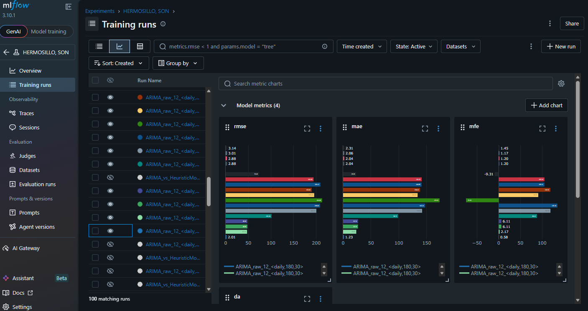
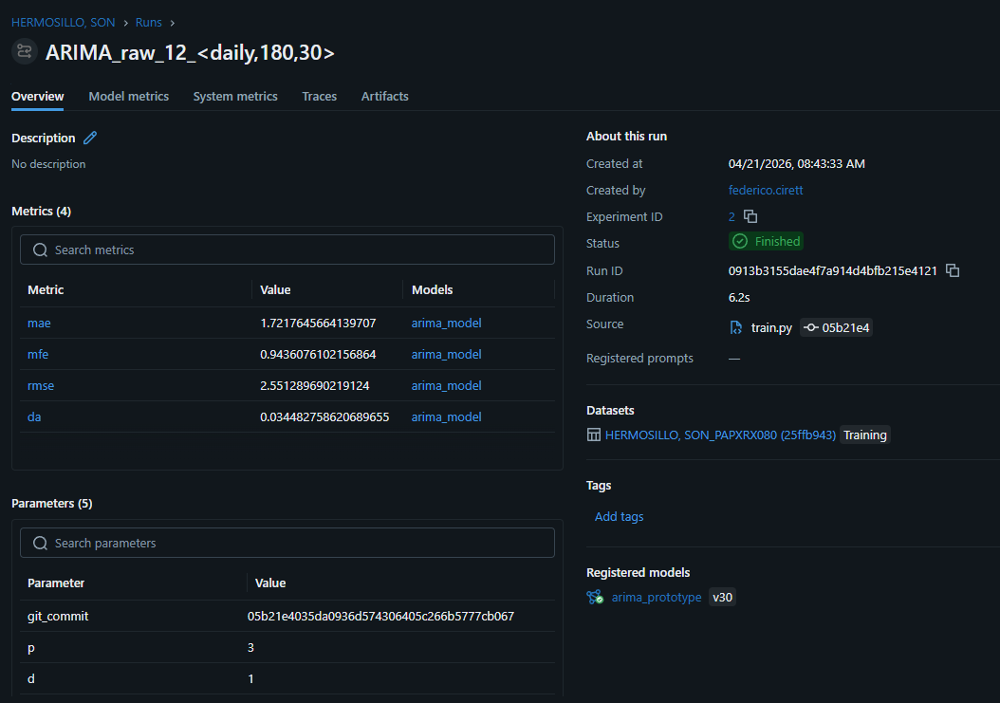
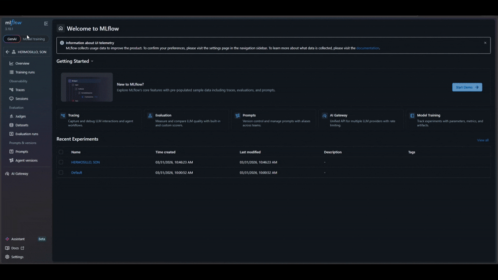

# MLOps de Entrenamiento y Monitoreo de Modelos 


Ecosistema de trabajo reproducible y monitoreable para entrenar, evaluar y actualizar modelos de manera sistemática. Facilita la mejora continua del rendimiento y permite detectar oportunamente problemas como degradación del modelo, cambios en la distribución de los datos o fallos en los procesos de ingestión.

---

## Instalación

**Requisitos previos:** `poetry >= 2.3`

1. Clona el repositorio `mlops`.
2. Instala las dependencias:

```bash
poetry install -e
```

3. Levanta la interfaz de MLflow:

```bash
poetry run mlflow ui
```

---

## Guía de Uso

Una vez iniciada la UI, accede a `http://<host>:5000` desde cualquier navegador.

### Comparación de corridas

Desde la vista principal es posible visualizar y comparar las métricas registradas en cada corrida de entrenamiento. Actualmente se monitorean:

- **MSE** — Mean Squared Error
- **RMSE** — Root Mean Squared Error
- **MAE** — Mean Absolute Error

<p align="left">
  
</p>

### Detalle de una corrida

Al acceder a una corrida específica se pueden consultar los parámetros de entrenamiento, los datasets utilizados, artefactos generados y demás metadatos registrados.

<p align="left">
  
</p>

---

## Demo

<p align="left">
  
</p>

---

## Tech Stack

| Capa | Tecnología |
|------|------------|
| Experimentación y monitoreo | MLflow 3.10 |
| Gestión de dependencias | Poetry 2.3|
| Procesamiento de datos | Pandas 2.3 |
| Lenguaje | Python 3.12 |


